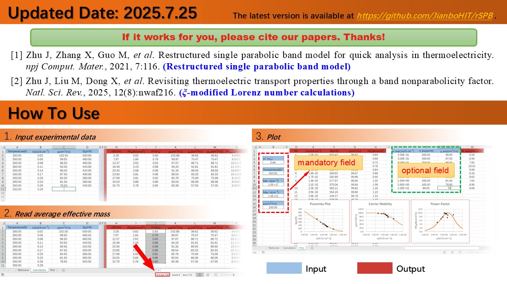

# rSPB

**重构单抛物带(RSPB)模型实现热电性能快速分析**

&nbsp;&nbsp;&nbsp;&nbsp;&nbsp;&nbsp;&nbsp;&nbsp;本项目通过 Office Excel® 模板实现重构单抛物带模型的计
算，输入参数包括塞贝克系数、载流子浓度、迁移率（或电导率），可以输出载流子有效质量***m****、本征迁移率***μ***0、权重迁移率
***μ***w、最优载流子浓度***n***opt及对应最大功率因子***PF***opt。
(**Ref**: J. Zhu, X. Zhang, M. Guo, *et al*. Restructured single parabolic band
model for quick analysis in thermoelectricity, *Npj Computational Materials*,
2021, **7**:116. https://doi.org/10.1038/s41524-021-00587-5)

&nbsp;&nbsp;&nbsp;&nbsp;&nbsp;&nbsp;&nbsp;&nbsp;此外，注意到实际材料的能带结构往往会偏离理想化抛物线关系，研究发现这
会导致由实验塞贝克系数计算的洛伦兹常数被系统性高估，模板中也包含了一种基于能带非抛物性因子(***ξ***)的修正方案以解决该问题。(**Ref**: J.
Zhu, M. Liu, X. Dong, *et al*. Revisiting thermoelectric transport properties
through a band nonparabolicity factor, *National Science Review*, 2025,
**12**(8):nwaf216. https://doi.org/10.1093/nsr/nwaf216)

**关键词:** 热电材料, 单抛物带模型，玻尔兹曼输运方程，能带非抛物性

## 更新日志

**[!!!]强烈推荐使用 Nonparabolicity 版！**

2025.07.25 发布 nonparabolicity 版和“中国材料大会2025”会议报告 PPT

2021.07.25 发布 Sigma 版和中文手册

2021.07.24 更新参考文献（版本号改为 2021.7.24）

2021.06.29 发布 1.0.0 版本

2021.03.21 发布初版计算模板工具(Office Excel®)

## 文章引用

[1] J. Zhu, X. Zhang, M. Guo, *et al*. Restructured single parabolic band model
for quick analysis in thermoelectricity, *Npj Computational Materials*, 2021,
**7**:116. (开放获取) https://doi.org/10.1038/s41524-021-00587-5

[2] J. Zhu, M. Liu, X. Dong, *et al*. Revisiting thermoelectric transport
properties through a band nonparabolicity factor, *National Science Review*,
2025, **12**(8):nwaf216. (开放获取) https://doi.org/10.1093/nsr/nwaf216
